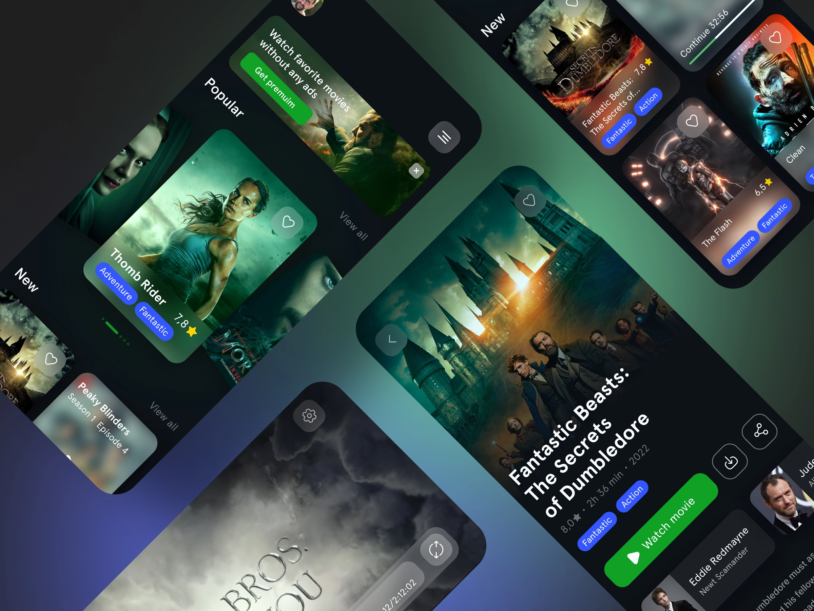

# Movie iOS App Case Study

## Introduction
Project to build an iOS app base on Movie App Prototype Design.

## Design
I chose [Movie App Design](https://dribbble.com/shots/18632188-Movie-App) from [Purrweb UI/UX Studio on Dribbble](https://dribbble.com/purrwebui).

## Data Source
I decided to use the [The Movie DB API](https://www.themoviedb.org/) as remote data source.

## App

The app consist in three main screens:

1. Home: Shows a collection of popular and new movies.
2. Detail: Shows movie's detail.
3. Player: Custom player to see moviews triler.

## Development

This app is develop using Business Driven Development (BDD) and Test Driven Development (TDD). To see the development process for each screen, take a look at the README folder.

